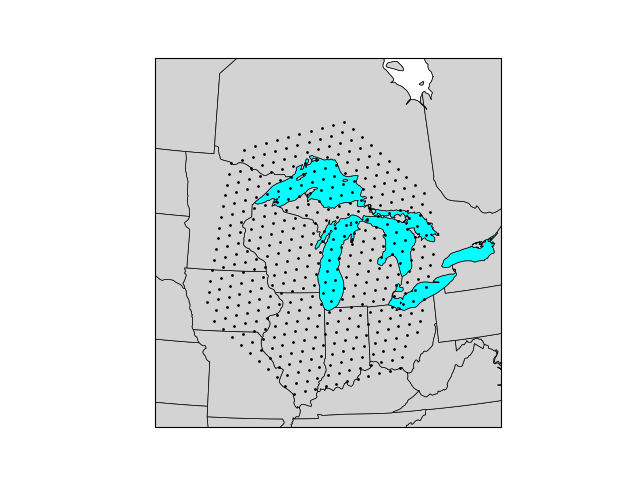

# grid_perimeter

Python module to extract the perimeter cells of a MPAS regional grid.

Regional Grid | Regional Grid Perimeter Cells
:---------:|:-----------:
 | 

# Required Python modules
- numpy
- matplotlib
- cartopy
- cartopy.util
- geocat
- geocat-comp
- geocat-viz
- geometric_features

# Example

An example of using the grid_perimeter module to generate the above plots:


```$ python3 examples/plot_grid_data.py test/Manitowoc.static.nc```


