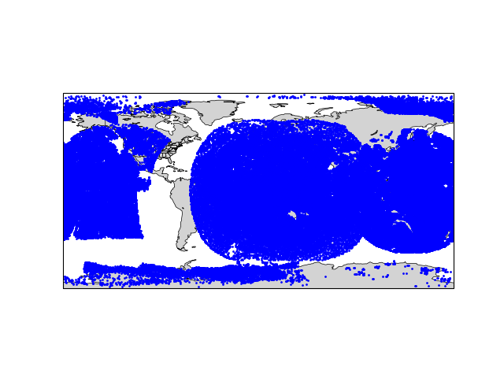
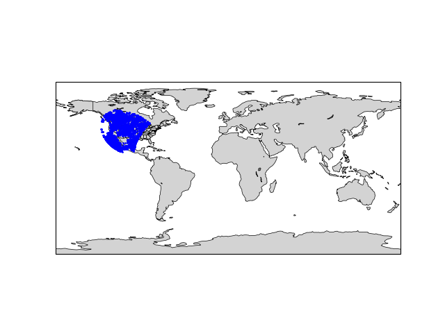

#grid_perimeter

Python module to extract the perimeter cells of a MPAS regional grid.

 | 

Regional Grid | Regional Grid Perimeter Cells
:---------:|:-----------:

# Required Python modules
- numpy
- matplotlib
- cartopy
- cartopy.util
- geocat
- geocat-comp
- geocat-viz
- geometric_features


# Build and Test
```$ cmake -B buildtree && cmake --build buildtree```

```$ cd buildtree```

```$ ctest```

# Example

An example of using the grid_perimeter module to generate the above plots:


```$ python3 examples/plot_random_nearest.py test/python_tests/Manitowoc.static.nc```

LAM Domain Filter an observation file against a MPAS regional domain.

```$ filter_obs.py <static_file> <obs_file lam_mask_file> ```

Example:

```$ filter_obs.py conus_15km.static.nc satwind_obs_2019050100.h5 lam_domain.h5```

Plot Filtered Observations:

```$ examples/plot_obs.py satwind_obs_2019050100.h5 --mask-file lam_domain.h5 --output lam_domain.png```

 | 
