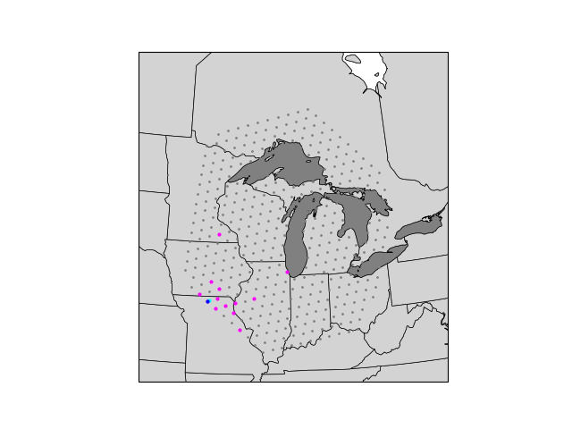
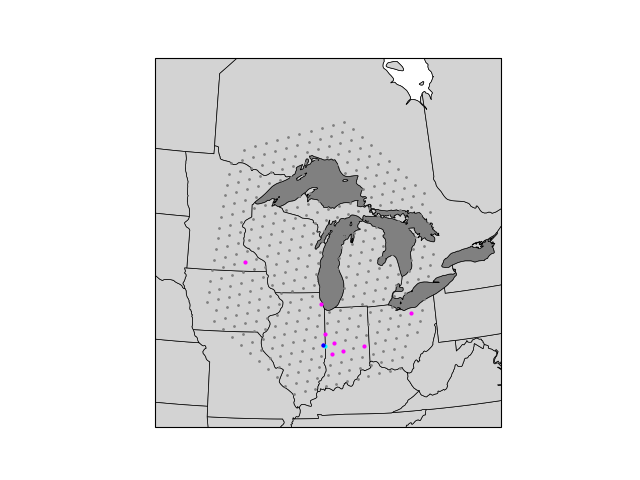

#grid_perimeter

Python module to extract the perimeter cells of a MPAS regional grid.

Regional Grid | Regional Grid Perimeter Cells
:---------:|:-----------:
 | 

# Required Python modules
- numpy
- matplotlib
- cartopy
- cartopy.util
- geocat
- geocat-comp
- geocat-viz
- geometric_features

# Build and Test
```$ cmake -B buildtree && cmake --build buildtree```

```$ cd buildtree```

```$ ctest```

# Example

An example of using the grid_perimeter module to generate the above plots:


```$ python3 examples/plot_random_nearest.py test/python_tests/Manitowoc.static.nc```

# Apptainer/Singularity Container
